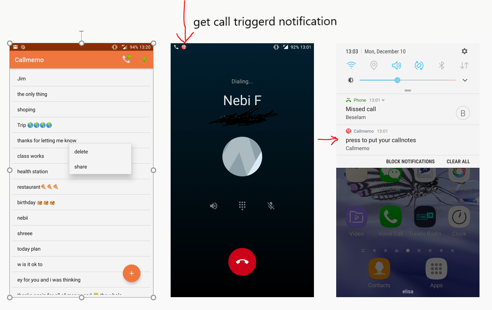
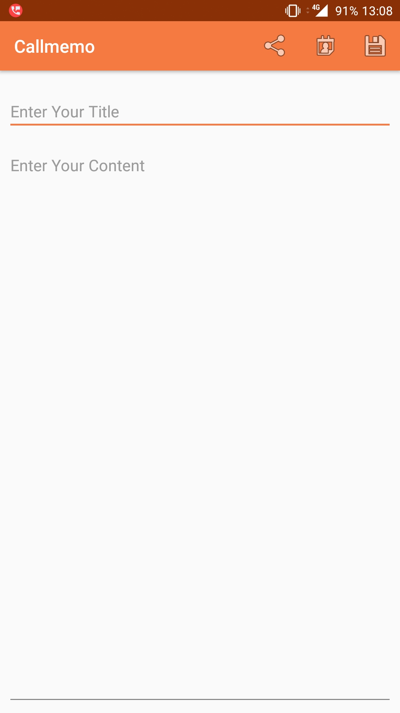
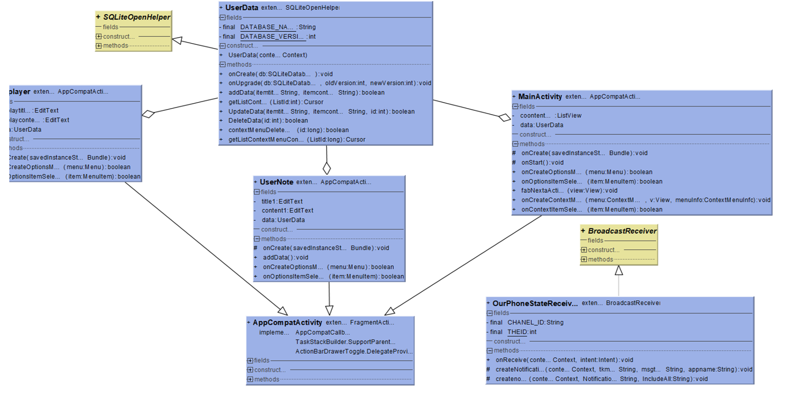

  # callmemo   - android-app                                                      
 
 #### this app is the only fully functional and published app during 2019 Metropolia first year IT Department android app development period 
 
 ----

. This is a usefull light-weight android app which is used for registering call notes  while on call.
using this app users can capture short notes quickly whenever they need.
- app written in java 
---
 # Features         
 
 
 | Min API       | Pub Date      |Current Version |
 | ------------- |:-------------:| -----:|
 |  4.0.3        |Dec 13,2018    | 2.0 |

 
 
 - Oncall push Notification                                         
 - SQLite 
 - Access to phone contact 
 - access to calander 
 - Edit callnotes 
 - Share callnotes
 
 
                                             
                                          

---
# UML Diagram 

   

---

#### [Link to Java_Doc](http://users.metropolia.fi/~beselama/callmemoJ_DOC/index.html)

---

#### [Download the app from playstore](https://play.google.com/store/apps/details?id=com.callmemonew.gbese.callmemo&hl=en)

